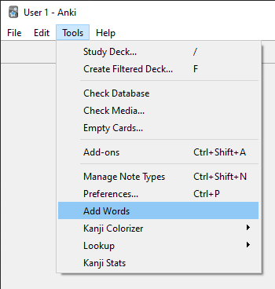
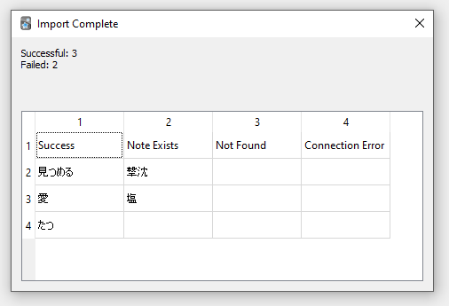

# Japanese Vocabulary Card Generator
This is an addon for the SRS software Anki that allows you to quickly add Japanese vocabulary to your deck using the [jisho.org](jisho.org) API.

## Installation
Download the latest release `.ankiaddon` file and install it with Anki's `install from file` option in the Add Ons menu.

## Usage
This plugin adds an option to Anki's `Tools` menu:\

This opens a new window where you can select the deck you would like to add to, and choose whether to add a card manually or add words from a file:\

The Add From File option allows you to select a text file containing Japanese words separated by newlines to add to your deck. After processing the file, a report is displayed:\

The Add Card option allows you to search for an individual word and decide whether to add it to your deck:\

